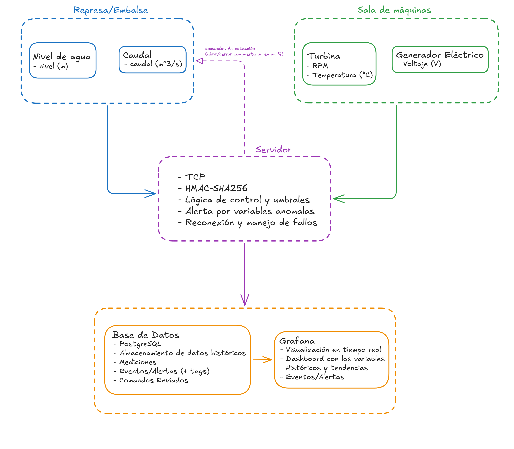

# Redes de Computadores — Proyecto Final

Sistema de monitoreo y control remoto para una central hidroeléctrica simulada, capaz de supervisar variables operacionales críticas y responder automáticamente ante condiciones fuera de rango.

---

## Arquitectura del sistema



Los nodos simulan variables físicas y las transmiten al servidor central vía TCP. El servidor valida la integridad de cada mensaje mediante HMAC-SHA256, registra las mediciones en PostgreSQL y evalúa umbrales operacionales. Ante condiciones anómalas, se generan alertas y se envían comandos de actuación de vuelta a los nodos correspondientes.

---

## Variables monitoreadas

| Nodo        | Variable     | Unidad | Rango operacional |
|-------------|--------------|--------|-------------------|
| `represa`   | nivel        | m      | 10 – 95           |
| `caudal`    | caudal       | m³/s   | 0 – 160           |
| `turbina`   | rpm          | RPM    | 0 – 700           |
| `turbina`   | temperatura  | °C     | 5 – 100           |
| `generador` | voltaje      | V      | 8000 – 16000      |

---

## Estructura del proyecto

```bash
Proyecto---Redes-de-Computadores/
├── db/
│   └── init.sql
│
├── grafana/
│   ├── dashboards/
│   │   └── dashboard_hidroelectrica.json
│   └── provisioning/
│       ├── dashboards/
│       │   └── dashboard.yml
│       └── datasources/
│           └── datasource.yml
│
├── nodos/
│    ├── utils_nodo.py
│    ├── nodo_represa.py
│    ├── nodo_caudal.py
│    ├── nodo_turbina.py
│    └── nodo_generador.py
│
├── servidor/
│   └── servidor.py
├── config.py
├── docker-compose.yml
└── requirements.txt
```

---

## Requisitos

- Python 3.10+
- Docker y Docker Compose

---

## Instalación y ejecución

### 1. Clonar el repositorio

```bash
git clone https://github.com/joaqsandoval04/Proyecto---Redes-de-Computadores.git
cd Proyecto---Redes-de-Computadores
```

### 2. Crear y activar entorno virtual

**Windows:**
```bash
python -m venv venv
venv\Scripts\activate
```

**Linux/macOS:**
```bash
python3 -m venv venv
source venv/bin/activate
```

### 3. Instalar dependencias de Python

```bash
pip install -r requirements.txt
```

### 4. Levantar base de datos y Grafana

```bash
docker compose up -d
```

Esto inicializa PostgreSQL con el schema definido en `db/init.sql` y levanta Grafana en `http://localhost:3000` con el dashboard ya configurado.

Credenciales:

| Servicio   | Usuario | Contraseña | Puerto |
|------------|---------|------------|--------|
| PostgreSQL | hidro   | hidro1234  | 5432   |
| Grafana    | admin   | hidro1234  | 3000   |

> **Nota:** Al abrir Grafana por primera vez, se recomienda usar el modo incógnito del navegador para evitar problemas de caché con el plugin de PostgreSQL.

### 5. Ejecutar el servidor central

En una terminal dedicada:

```bash
python servidor/servidor.py
```

### 6. Ejecutar los nodos simulados

Cada nodo en una terminal separada, desde la carpeta `nodos/`:

```bash
cd nodos
python nodo_represa.py
python nodo_caudal.py
python nodo_turbina.py
python nodo_generador.py
```
---

## Protocolo de mensajes

Cada nodo envía un mensaje JSON por línea (`\n` como delimitador):

```json
{
    "nodo":      "turbina",
    "variable":  "rpm",
    "valor":     435.7,
    "timestamp": "2026-07-03T22:15:00.123Z",
    "hmac":      "a3f9c1..."
}
```

El servidor responde con `{"status": "ok"}` o, si corresponde, con un comando de actuación:

```json
{
    "status":    "comando",
    "comando":   "cerrar_compuerta",
    "parametro": 50.0
}
```

El campo `hmac` se calcula sobre el resto del mensaje con HMAC-SHA256 y una clave compartida entre todos los componentes del sistema.

---

## Base de datos

Tres tablas en PostgreSQL:

- `mediciones` — registro continuo de todas las variables por nodo
- `eventos` — alertas y anomalías detectadas por el servidor
- `comandos` — historial de comandos de actuación enviados a los nodos

---
